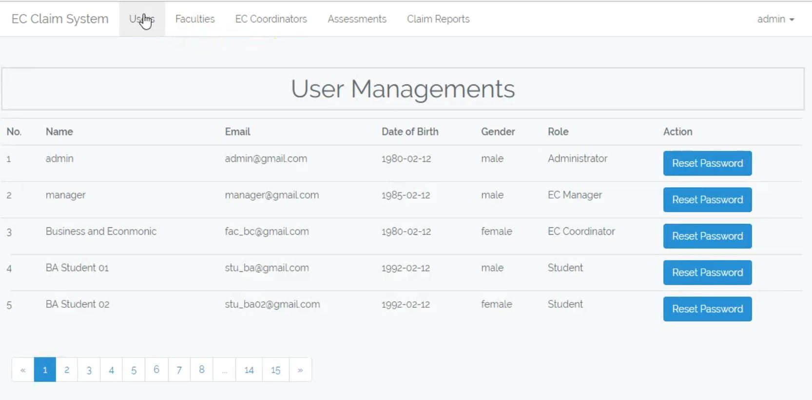

# EC Claim Application

EC Claim Application is the subsystem for the large university which is the based on the roles for collecting and processing of EC Claim. For building the web-based application. In this subsystem, there are four roles who access the system, admin can access the whole system with add assessment and the manager can see the whole system. On the other hand, the student can claim their department assessment subject and EC coordinator can access the EC claim accepted and rejected options. Therefore, the project live demo, repository, and screencast video are following below:

**Version**: 1.0 Release of the EC Claim Application.

- Application Live: https://live-ec-claim.herokuapp.com/
- Screencast video for live demo presentation without audio:
  [](https://youtu.be/SbTkuMx7zRc 'EcClaim Video')

---

## Table of Contents

- [Overview](#overview)
- [The Advantages of System](#The-Advantages-of-System)
- [The Limitations of System](#The-Limitations-of-System)
- [The System Features List](#system-features-list)
- [Entity Relationship Diagram (ERD)](#Entity-Relationship-Diagram)
- [Technologies and Libraries](#technologies-and-libraries)
- [Further Development](#further-development)
- [How to run the System](#how-to-run-the-system)
- [Summary](#summary)
- [References](#references)

---

## Overview

This is identified that the project developed as calling name EC_Cleam. EC Claim is the web-based subsystem which is developed for the university. In the evaluation of the system that has been trying to deliver the best product within the limitation of time but there was still possible to implement new feature and function for a best attractive product. Therefore, here is described the product evaluation and process with strength, weakness and further development of the system.

## The Advantages of System

- The application is fully responsive.
- Navigation panel is defined by the role-based with common icons.
- The system is authenticated by the roles based and security is very high.
- Validation and verification are fully considered with the relevant error or success message.
- LARAVEL5 PHP based framework and used Object-oriented Relational Model (ORM) for the database model design.

## The Limitations of System

- The system is not used highly graphics and best UX design.
- Faculty name, department name can’t have deleted through the role.
- Any information can’t modify by the single click.
- There is no way for user profile information updated features.
- The system is not used another users.

## The System Features List

- Manage the faculty, department, and users with their relevant information.
- Searching options with role-based access for faculty, admin within selective actions.
- Highly user interface design with reports, graphical and visual chart.
- Personal email processing system with real-time notifications.

## Entity-Relationship-Diagram


## Technologies and libraries

- HTML5 & Bootstrap 3+
- Laravel ^5 & ORM MySql
- Ajax, jQuery and JSON.
- Bcrypt Password Hashing
- Heroku & Git Depeloyment

## Further Development

- Highly UX design with graphical and visual chart reports.
- Personal email processing within the mail notification system.
- Refresh the authentication token when it will be expired.
- Refactoring coding standard with live data loaded.
- The testing plan implements with PHPUnit tools.

## How to run the System

### Run on the development environment

- Open terminal window with your dev area
- Then run this below comments

```sh
$ git clone https://github.com/vorsurm/ECClaimApplication.git

$ cd ECClaimApplication
$ composer install
$ cp .env.example .env
$ php artisan key:generate
$ config .env file, below description
$ php artisan migrate
$ php artisan serve
$ It\`s open a browser window with http://localhost:8000/login

```

### Configure environment variables

- Add the .env variable name of the following below information.

```

MySQL Config:
==============
DB_CONNECTION=mysql
DB_HOST=127.0.0.1
DB_PORT=3306
DB_DATABASE=sev_system
DB_USERNAME=username
DB_PASSWORD=password

```

## Summary

EC Claim Application is successfully developed and implemented also it's live now as a first version 1.0. After the hardworking and self-studying period, I would like to say, the product will be achieved with full features and functionality for the initial requirements. In the end, The Students can use this application for their claim any assignment purpose.

## References

- http://ecc.gov.ph/frequently-asked-questions/
- https://aws.amazon.com/blogs/startups/scaling-on-aws-part-3-500k-users
- https://laravel-json-api.readthedocs.io/en/latest/features/http-clients/
- https://www.innofied.com/top-10-laravel-best-practices/
- https://www.quora.com/What-are-the-Laravel-best-practices

```

```
